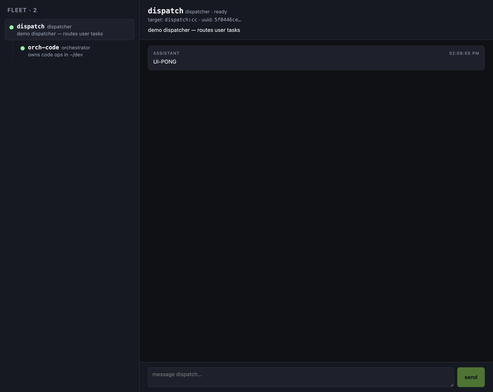

# fleetview

Minimal local web UI for the [roster](../roster) fleet.

- **Sidebar** — agent tree with color-coded live status (green ready,
  amber streaming, gray stopped).
- **Detail pane** — selected agent's metadata + parsed conversation
  (user / assistant / tool_use / tool_result blocks) straight from the
  Claude Code JSONL for that session.
- **Notify box** — `POST /api/agents/:id/notify` → `roster notify …` →
  message arrives in the recipient's TUI as a new user turn.

Dead simple v0.1: polls `/api/fleet` every 2s. No SSE, no auth, no
fsnotify — all on the table for v0.2 when they matter.

## Install & run

```bash
# Build UI + Go backend
make build

# Dev — two processes
./fleetview                 # backend on :8080
cd web && npm run dev       # Vite dev server on :5173 (proxies /api to :8080)

# Then open http://localhost:5173
```

Requires `roster`, `camux`, and `amux` on `$PATH`.

## API

| | |
|---|---|
| `GET /api/fleet` | All agents with live status merged from camux |
| `GET /api/agents/:id/messages` | Parsed turns from the agent's Claude JSONL |
| `POST /api/agents/:id/notify` | Shells out to `roster notify <id> <msg> --from ui` |

## Where it reads from

- `~/.local/share/roster/agents/*.json` — fleet topology
- `~/.claude/projects/*/<session_uuid>.jsonl` — per-agent conversation stream
- `camux status <target>` — live pane status

## Screenshot


